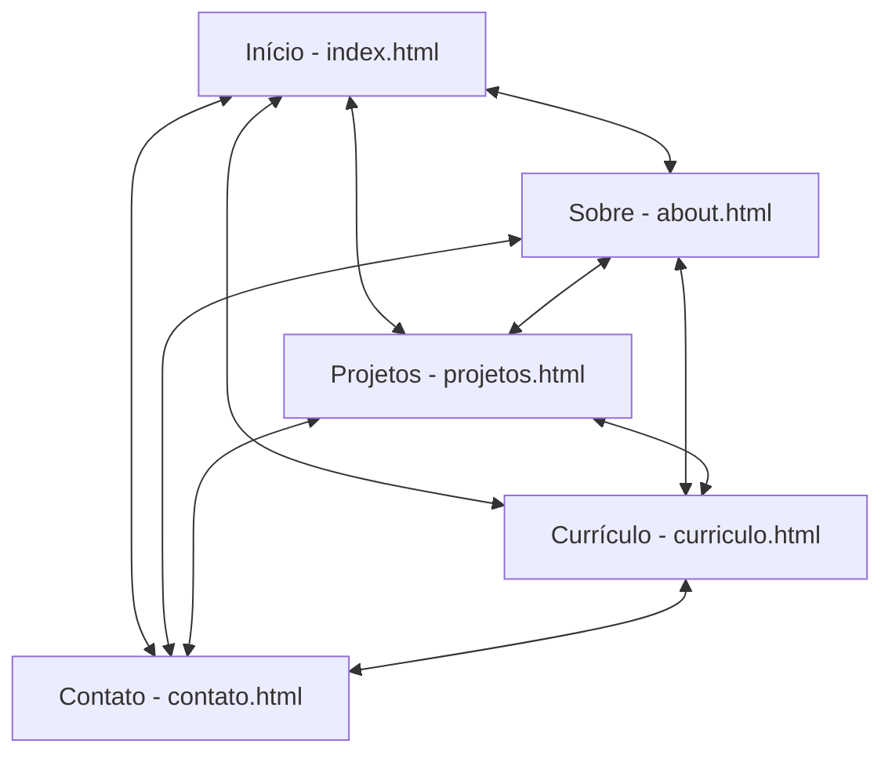

# Relatório Técnico do Projeto: Portfólio Pessoal Responsivo
**Aluno:** Lucas Mustafa  
**Disciplina:** Desenvolvimento Web / Engenharia de Software  
**Data:** 25 de Junho de 2026  

---

## 1. Introdução
Este documento detalha o desenvolvimento do website do portfólio pessoal do desenvolvedor .NET **Lucas Mustafa**. O projeto foi concebido e implementado de forma responsiva, utilizando HTML5 semântico, CSS3 estruturado e JavaScript puro (ES6+). Ele atende a todos os requisitos acadêmicos da disciplina, incluindo cinco páginas interconectadas, controle de tema dinâmico, menu hambúrguer interativo para mobile, filtro dinâmico de projetos, formulário de contato com validação robusta em JavaScript e boas práticas de SEO básico.

---

## 2. Escolhas de Design e Usabilidade

### 2.1 Paleta de Cores e Temas (Claro/Escuro)
A interface foi projetada utilizando **Variáveis CSS (Custom Properties)** para permitir uma troca fluida de temas sem duplicação de folhas de estilo. 
*   **Tema Claro (Default):** Utiliza um fundo limpo e moderno (`#f8fafc`) combinado com texto escuro e contrastante (`#0f172a`). A cor de destaque primária é o verde ciano/teal (`#0d9488`), que cria uma identidade visual tecnológica e elegante.
*   **Tema Escuro (Dark Mode):** Ativado dinamicamente pelo atributo `data-theme="dark"`. Ele usa um tom obsidiana azulado profundo para o fundo (`#0b0f19`), cor de texto suave (`#cbd5e1`) e um verde menta luminoso para destaques (`#2dd4bf`), reduzindo a fadiga ocular em ambientes de baixa luminosidade.

### 2.2 Tipografia
*   **Títulos:** Utiliza a fonte **Outfit** (sans-serif geométrica, importada do Google Fonts) para dar modernidade, dinamismo e uma forte identidade de tecnologia aos cabeçalhos principais (`h1`, `h2`), ideal para o portfólio de um engenheiro de software.
*   **Corpo de Texto:** Utiliza a fonte **Inter** (sans-serif de alta legibilidade, importada do Google Fonts) para garantir clareza nos textos informativos, listas e rótulos de formulário.

### 2.3 Responsividade e Layout
O design segue princípios modernos de flexibilidade através de:
*   **Flexbox:** Utilizado na barra de navegação (`.cabecalho__menu`), na distribuição dos links de redes sociais, nos itens de contato do rodapé e na flexibilidade dos formulários.
*   **Media Queries:** Breakpoints específicos foram estabelecidos para garantir que o layout se adapte a dispositivos móveis, tablets e monitores desktop:
    *   `1200px` (monitores médios): Ajusta o espaçamento interno do cabeçalho e a escala das fotos de perfil.
    *   `992px` (laptops/tablets horizontais): Converte o contêiner de contato de duas colunas para uma coluna vertical empilhada.
    *   `768px` (tablets/smartphones): Oculta o menu horizontal padrão do cabeçalho e ativa o botão de **Menu Hambúrguer**, reorganiza o grid de projetos e ajusta o padding lateral das seções para `5%`.
    *   `480px` (smartphones pequenos): Reduz o tamanho de fontes e botões, garantindo que o conteúdo permaneça legível sem transbordar horizontalmente.

---

## 3. Arquitetura do Website

O site é composto por cinco páginas HTML estáticas, interligadas através de caminhos relativos e compartilhando o mesmo sistema de estilos e lógica.

### 3.1 Estrutura de Arquivos
*   `/index.html` — Página principal de apresentação (landing page com links rápidos).
*   `/about.html` — Detalhes da trajetória do desenvolvedor.
*   `/projetos.html` — Vitrine de projetos com sistema dinâmico de filtragem por tags.
*   `/curriculo.html` — Apresentação profissional estruturada do currículo, experiências acadêmicas e certificações.
*   `/contato.html` — Formulário de e-mail integrado e canais de comunicação direta.
*   `/style/`
    *   `reset.css` — Normalização de estilos padrão do navegador.
    *   `variables.css` — Definição de tokens de design globais.
    *   `style.css` — Estilo principal unificador do site, layouts específicos e media queries responsivos.
    *   `header.css`, `main.css`, `links.css`, `footer.css`, `projects.css` — Módulos parciais importados de forma estruturada.
*   `/script/`
    *   `app.js` — Arquivo único de script contendo toda a lógica JavaScript.
*   `/assets/` — Pasta contendo imagens otimizadas, ícones e o documento PDF do currículo.

---

## 4. Recursos e Conceitos Tecnológicos Aplicados

### 4.1 HTML5 Semântico e SEO Básico
Foram implementados conceitos sólidos de indexação orgânica e acessibilidade:
*   **Tags Semânticas:** Uso correto de `<header>`, `<nav>`, `<main>`, `<section>`, `<aside>`, `<footer>` e `<article>` ao invés de divisões genéricas (`
`), garantindo melhor interpretação por tecnologias assistivas e robôs de busca (como o Googlebot).
*   **Hierarquia de Títulos:** Cada página possui um único `<h1>` como título principal, seguido por `<h2>` e `<h3>` conforme o grau de importância das subseções.
*   **Tags de Metadados (SEO):** Inclusão de `meta description` otimizadas, `meta keywords`, definição de idioma (`lang="pt-br"`) e codificação UTF-8 em todas as páginas.
*   **Acessibilidade:** Imagens possuem textos descritivos (`alt`) apropriados e os botões interativos de controle ou links externos sem texto visível possuem a tag `aria-label` descritiva.

### 4.2 CSS3 Moderno
*   **Custom Properties (Variáveis):** Facilita a manutenção do código. O tema escuro redefine apenas os tokens de cores sob o seletor `[data-theme="dark"]`, mantendo o restante do CSS inalterado.
*   **Gradientes e Efeitos de Glassmorphism:** Transparências no cabeçalho fixo com `backdrop-filter: blur(10px)` e gradientes lineares nas bordas e rodapé proporcionam uma estética moderna e premium.

### 4.3 JavaScript Interativo (Sem Bibliotecas Externas)
A interatividade exigida no roteiro foi implementada via JS puro (Vanilla JS), garantindo performance e controle total do código. Foram criados **quatro efeitos interativos principais**:

1.  **Alternador Dinâmico de Temas (Claro/Escuro):** 
    O script lê e altera o atributo de dados `data-theme` na tag raiz `<html>`. A escolha do usuário é gravada no `localStorage` do navegador para persistir a escolha nas próximas visitas ou ao navegar entre as páginas.
2.  **Menu de Navegação Responsivo (Hambúrguer):**
    Em telas pequenas (`<= 768px`), um botão de alternância substitui o menu horizontal. Ao ser acionado, o JavaScript alterna a classe `.ativo` no menu, aplicando animações suaves de abertura (`@keyframes slideDown`). O menu fecha automaticamente se o usuário clicar em um link ou em qualquer área fora dele.
3.  **Filtro de Projetos Em Tempo Real:**
    Na página `projetos.html`, os botões de filtro (`Todos`, `Front-end/Web`, `Back-end/.NET`) manipulam a visibilidade dos cards de projetos através do atributo `data-categoria`. O JS aplica um efeito de transição gradual diminuindo a opacidade e escala (`opacity: 0`, `transform: scale(0.8)`) antes de ocultá-los via CSS (`display: none`).
4.  **Validação de Formulário com Feedback Visual:**
    O formulário em `contato.html` possui validação avançada de campos no evento `submit`. Se algum campo falhar (e-mail mal formatado por regex, nome curto ou campos vazios), mensagens de erro contextuais são exibidas abaixo do campo correspondente, aplicando a classe CSS `.invalido`. Quando válido, o botão exibe um spinner animado simulando o envio, exibe um banner de sucesso e limpa os campos.

---

## 5. Desafios Enfrentados e Soluções

1.  **Transições de Layout com `display: none`:**  
    *Desafio:* O CSS não consegue interpolar animações quando uma propriedade muda diretamente para `display: none` ou de volta para `block`. No filtro de projetos, isso causava um corte brusco na animação.  
    *Solução:* Usar o JavaScript para orquestrar as transições em duas etapas: na entrada de um elemento, primeiro define-se `display: block` e usa-se um curto `setTimeout` de `50ms` para aplicar a escala e opacidade máximas. Na saída, aplica-se a opacidade zero e a redução de escala e, através de um temporizador de `300ms` (tempo idêntico à transição CSS), define-se `display: none`.
2.  **Fechar Menu Mobile ao Clicar Fora:**  
    *Desafio:* O menu hambúrguer móvel permanecia aberto caso o usuário clicasse em qualquer local vazio da tela, prejudicando a experiência.  
    *Solução:* Adicionado um listener de evento global ao objeto `document` que verifica se o alvo do clique (`e.target`) não está contido no botão do menu nem no painel de links. Se o clique for externo, a classe `.ativo` é removida automaticamente.
3.  **Persistência do Tema Selecionado:**  
    *Desafio:* Ao atualizar a página ou mudar de aba no menu de navegação, o tema redefinia para o padrão (claro), causando um clarão visual incômodo.  
    *Solução:* Implementado o armazenamento local com `localStorage.setItem('tema', novoTema)` e checagem imediata no evento `DOMContentLoaded` de cada página para aplicar a classe salva antes de renderizar o corpo da página.

---

## 6. Screenshots do Resultado Final

*Nota: As imagens representam a disposição e o design responsivo visualizado no navegador.*

### 6.1 Página Inicial (Tema Claro / Desktop)
A página inicial (`index.html`) apresenta Lucas Mustafa em uma grade flexível, exibindo uma fotografia de perfil à direita e sua apresentação à esquerda, com links de redes sociais destacados com efeitos de elevação suave ao passar o mouse.

### 6.2 Projetos com Filtro de Categoria (Tema Escuro / Desktop)
A página de projetos (`projetos.html`) exibe os cards de projetos com sombreamento moderno. Ao clicar na categoria "Back-end / .NET", a interface oculta de forma fluida os projetos de front-end e destaca apenas os sistemas criados em C#. O tema escuro é ativo via botão flutuante no canto superior direito.

### 6.3 Formulário de Contato e Validação de Erro (Mobile / Smartphone)
Na tela mobile, o cabeçalho adapta-se exibindo o ícone de hambúrguer. A página de contato (`contato.html`) exibe os inputs dispostos verticalmente. Caso o formulário seja enviado com e-mail incorreto ou nome ausente, mensagens de aviso vermelhas aparecem destacando o erro em tempo real.

---

## 7. Conclusão
O desenvolvimento do portfólio consolida de forma prática os conceitos ensinados em sala de aula. O uso correto do HTML5 semântico atende aos padrões W3C e de SEO básico; o CSS3 avança na estruturação limpa com a modularização das folhas de estilo e responsividade; e o JavaScript traz a interatividade premium que eleva a experiência do usuário final, simulando o ambiente de entrega de um sistema profissional de mercado.
